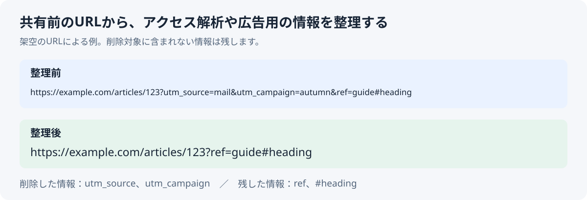

# Local URL Cleaner

記事や商品ページのURLを送る前に、アクセス解析や広告用の情報を取り除く小さなツールです。入力したURLはブラウザ内で処理し、送信・保存しません。

**[ブラウザで試す](https://supportapp3-lab.github.io/url-cleaner-local/)** · [Qiitaの説明を読む](https://qiita.com/supportapp3/items/e142176237093d17c5c5)



## 試し方

1. ページを開き、「架空のURLで試す」を押します。自分のURLを貼り付けても使えます。
2. 「整理後のURL」と、削除した情報の名前を確認します。
3. 問題がなければ「整理後のURLをコピー」を押します。

コピーが許可されない環境では、結果を選択します。Windowsなら Ctrl+C、Macなら ⌘C でコピーしてください。

たとえば次の架空URLでは、`utm_source` と `utm_campaign` を削除します。`ref` と `#heading` は残ります。

```text
整理前
https://example.com/articles/123?utm_source=mail&utm_campaign=autumn&ref=guide#heading

整理後
https://example.com/articles/123?ref=guide#heading
```

URLの後ろには、ページの表示に必要な情報が含まれることもあります。すべての長いURLを短くするツールではありません。

## 残した情報の表記について

削除する情報がある場合は、ブラウザがURLとして読み取った表記から結果を作ります。そのため、残した記号や日本語の表記が変わることがあります。たとえば、次の架空URLでは、残した値に含まれる `'` が `%27` になります。

```text
整理前
https://example.com/?q=O'Reilly&utm_source=mail

整理後
https://example.com/?q=O%27Reilly
```

残す項目の順序は維持しますが、入力した文字列と完全に同じ表記になるとは限りません。ホスト名の大文字・小文字や、一部のパス・フラグメントの表記も変わる場合があります。フラグメントは、`#heading` のようにURLの末尾に付く部分です。

削除対象がない場合は、前後の空白を取り除いた入力をそのまま返します。上の例から `&utm_source=mail` を外したURLでは、`'` の表記もそのまま残ります。

この説明は、現在の実装と[ブラウザのURL仕様](https://url.spec.whatwg.org/#special-query-percent-encode-set)に基づいています。URLの表記をそのまま残す必要がある場合は、結果を照らし合わせてから使ってください。

## 自分のパソコンに保存して使う

リポジトリをダウンロードして `index.html` を開くか、[1ファイル版をダウンロード](https://github.com/supportapp3-lab/url-cleaner-local/raw/main/browser-e2e.html?download=1)してブラウザで開いてください。インストールやサーバーは不要です。1ファイル版も同じ画面・処理を使います。

Web版を開くための通信は発生しますが、入力したURLを送る処理やアクセス解析はありません。

## Technical details (English)

A small browser tool that removes a documented set of common tracking parameters before you share a link. It processes the URL in your browser and does not send or save it.

## Use

The interface is in Japanese. Open `index.html` in a recent desktop or mobile browser, paste one complete HTTP or HTTPS URL, and choose **URLを整理する**. Review the cleaned link and removed parameter names, then use **整理後のURLをコピー**. If clipboard access is unavailable, the cleaned URL is selected so you can copy it with your keyboard shortcut.

## Download a single-file browser demo

[Download the standalone browser demo](https://github.com/supportapp3-lab/url-cleaner-local/raw/main/browser-e2e.html?download=1), then open the downloaded HTML file in a browser. The file bundles the app scripts into one page and does not need a server, install, or command line. Use **架空のURLで試す** to try a fictional URL, check the removed-parameter message, use **整理後のURLをコピー**, try invalid text, and narrow the browser window to check the mobile layout. If clipboard permission is unavailable for a local file, the app selects the result for keyboard copying.

## What it removes

- Any decoded query parameter name beginning with `utm_` and at least one character after the underscore, such as `utm_source`, `utm_medium`, and `utm_campaign`.
- The exact, case-insensitive names `gclid`, `dclid`, `gbraid`, `wbraid`, `fbclid`, `msclkid`, `mc_cid`, and `mc_eid`.

Repeated instances of supported tracking parameters are all removed and counted. When a tracking parameter is removed, the result is built from the browser URL parser's serialized components. Unknown query segments keep their order and their spelling within the parser's serialized query; the cleaner does not pass those segments through URLSearchParams. A key is decoded only to decide whether it matches a listed rule. The serialized fragment is retained.

This is not a guarantee of character-for-character preservation of the input. The browser parser can encode a literal apostrophe in an HTTP/HTTPS query as `%27`, encode non-ASCII text, normalize the hostname, or normalize other URL components before removal. For example, `https://example.com/?q=O'Reilly&utm_source=mail` becomes `https://example.com/?q=O%27Reilly`. If no tracking parameter is removed, the trimmed original input is returned unchanged. See the [URL Standard](https://url.spec.whatwg.org/#special-query-percent-encode-set).

## Privacy and limits

All processing happens in the page. The app has no server, analytics, telemetry, external API, or runtime network dependency. The page uses local scripts and does not submit the form. It supports one absolute HTTP or HTTPS URL at a time. It does not follow redirects, inspect destination pages, shorten links, or remove unknown or site-specific parameters. Some parameters that resemble tracking keys may be meaningful on a particular site; review the result before sharing. Clipboard access depends on browser permissions; the app provides a manual copy fallback.

## Development

Run the tests with Node.js; there are no package dependencies:

```text
node tools/build-browser-e2e.cjs
node --test tests/core.test.cjs
```

Rebuild the single-file demo after changing the page or either app script.

## License

[MIT License](LICENSE).
